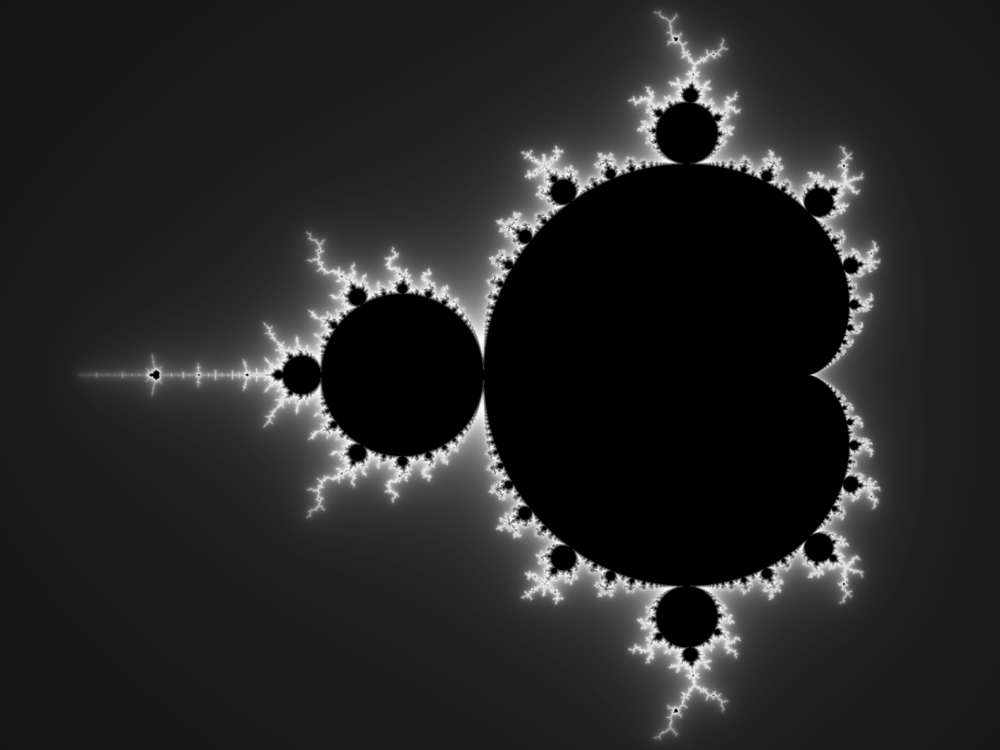

# Exploration of Genetic Algorithm
This project was an exploration into Genetic Algorithm use in generating images. Given an image and a set number of circles can we approximate the image?

# Method
We utilized a pool of individual circles and performed crossover and mutations for several generations. The best circle was found, then the process was repeated.

This was performed on some simple images to ensure it was working correctly:

  
  

Then we performed tests on more complicated images:

  
  
  

# Progression & Results

  
  
  
  

